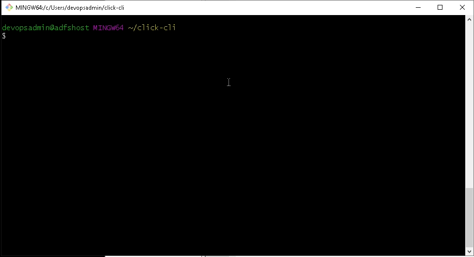

## Python Windows CLI with Click

Python Dev CLI Environment for Windows(Click Package)

## Requirements

* Install Git/Git-bash.(Using Gitbash Terminal)
* Install Chocolatey(optional)
* Install Python `3.7.x` - `choco install python -y`
* Install virtualenv `pip install virtualenv`
* Create a virtual environment `virtualenv venv`
* Activate the virtual environment `.\venv\Scripts\activate.bat`
* Run `python -V` to check.
* Install your requirements `pip install -r requirements.txt`
* Make your environment editable `pip install --editable .`

## References

* https://programwithus.com/learn-to-code/Pip-and-virtualenv-on-Windows/

